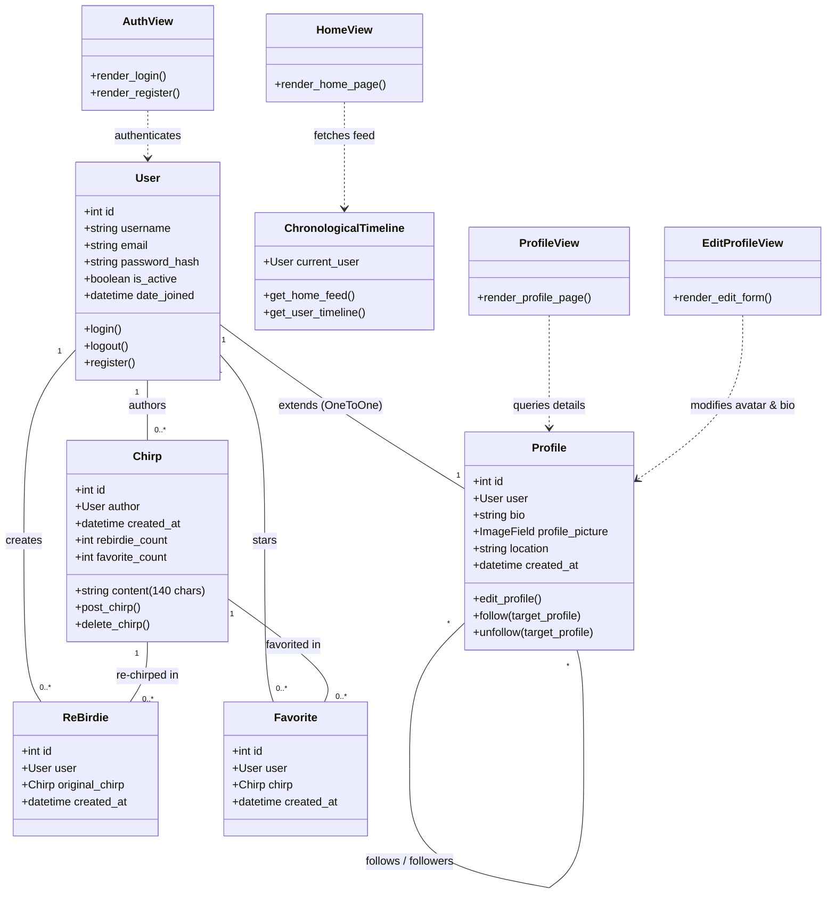

# Summer2026Project
Final Project Django python 

Alejandro Fernandez (cs14af)
Neale Matthew Nicolas (survivaldude29)
Jarek Elizondo

## 📊 Project Prototype

> 🔗 **Direct Link:** [View Presentation Slides on SharePoint](https://utrgv-my.sharepoint.com/:p:/g/personal/jarek_elizondo01_utrgv_edu/IQBrNUVEenwKRa5FHsOdu9uzAWXnKZQqg6A3LzYEw7r7Jpg?e=iDD04J)

## 📝 User Stories 
https://docs.google.com/document/d/e/2PACX-1vTa8L-2wFHpCj6CPMM3tuTFSN3lSX4q_s9fNBRpn6slTZDFPWeZoIT6Nfn3Up73G_LbboLEjnDWRpTe/pub

## 📊 Architecture & UML Diagram

Below is the UML Class Diagram illustrating the **Birdie** system architecture, user management, profile extension model, 140-character post structure, and chronological feed controllers:

RECOMMENDED FEATURES:

    • Activities/Task Schedule Manager
    
    • Add/view/edit weekly activities schedule
    
    • Notifications or reminders for upcoming events
    Event Calendar
    
    • View map
    
    • Subscribe to categories (academic, sports, civil, clubs)
    Bulletin Board
    
    • Browse and post announcements
    
    •Emergency Contacts & Quick Access
    
    •Easy-access button for security, counseling, health services

    
TECHNICAL REQUIREMENTS:

    • Requirements specification (functional & non-functional)
    
    • UML diagrams (use case, class, sequence)
    
    • Wireframes/mockups
    
    • Roles setup
    
    • Version control with Git & GitHub
    
    • Agile sprints
    
    • Testing
    
    • Code documentation & user manual

Current prototype idea: Twitter based setting

Hitting on the nostalgia of people who desire to use the old and familiar types of social media, we give you "Birdie", a remake of the Twitter app scene before it became "X". A faithful recreation of one of the old social media types in the late 2000s - early 2010s era.
Core pillars of the Birdie experience:

Chronological-only timeline — no algorithmic curation, ever

Character-limited posts — reinforcing the brevity and creativity that defined the platform

Retweets & Favorites — the original, simpler engagement mechanics, not modern "like/share/react" combos

Minimalist, era-accurate UI — a deliberate throwback in color scheme, iconography, and layout

No ads, no algorithm, no noise — just people, posts, and conversation, the way it used to be

Agile Planning Methodology

Agile manifesto: First Preliminary - Joining a randomized group, the planning, the blueprint, and the template

Consistent with adaptation with change, being in a randomized group with randomized members proves adaptability for desire to achieve results for software development projects.

We started with a separated 3 man individualized brainstorm session, to maximize the number of potential app ideas for planning. The result was a nostalgic theme on social media, leading us to the app we call “Birdie”. Birdie is the app that gets inspiration to the late 2000s early 2010’s version of Twitter, before it became “X”. 

We then led to a group meeting session to solidify the blueprint outline of our future made app, starting with the setup of our boilerplate of the Django based framework application to the virtual template setup on Github ready for testing.

Agile manifesto: Second Preliminary - The Prototype

To push for results, we worked on the necessary code to start the basic running of our homepage and developed user stories to outline how we wanted to make the app work.

With our developed stories, this helped us work on the concept of intended features of our app, which helped us make our wireframe setup on Powerpoint slides for our vision of our app.

Considering the necessity of workflow under asynchronous timeframes, three different components are all coded in 3 separate local computers, which was the skeleton of our home page, the navbar, and our user registration/login system. This was then all connected by making new branches and connecting them all, in a checkpoint by checkpoint manner. Each time a new branch was made and code was changed, the code was debugged to prevent a bottleneck to workflow when possible. This project considers the "main" branch always being the branch that is the finalized working draft versions of our code, while other branches are considered templates, components, or "checkpoints" to test proper github pushes, pulls, and merges of code.

Agile manifesto: Final Presentation to delivery

We then settled into direct designation of 3 roles with flexibility: a front-end developer, a back-end developer, and someone who is to connect the software to a cloud platform server.
Combining the code together was a hassle due to different working parts unable to merge in Github, however, with AI assistance, it was possible to deal with the bugs in this timefrme.

How to Activate Environment
 
Step 1
source virt/bin/activate 

Step 2
cd Alpha1

Step 3
python manage.py runserver

Step 4
Go to ports, under forwarded address

Then

Under ports, go to the link

Step 5
Hover over address, open in browser

